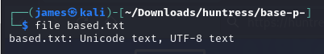
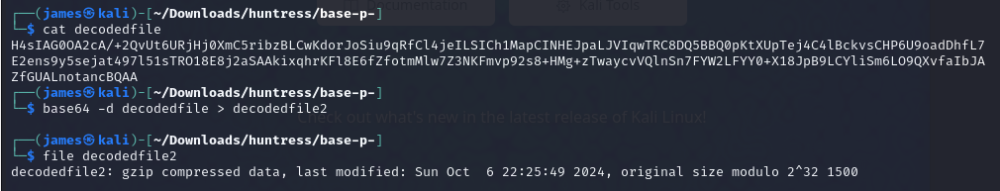
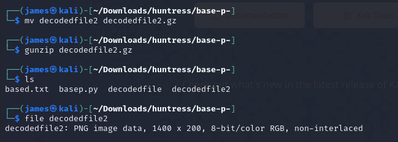
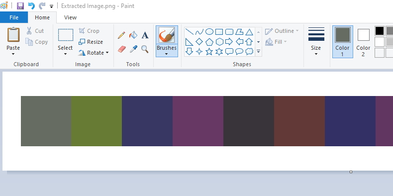
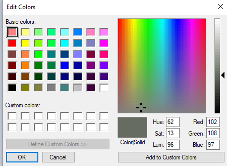
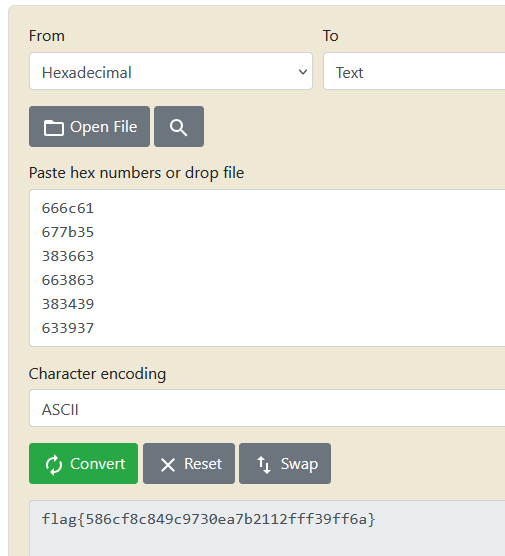

We are given the provided text file and need to decode it.



Running the file command against the downloaded file, we can see it is a unicode encoded text file.  I wrote a quick Python script to decode the data.

```python
import base65536

data = "楈繳籁萰杁癣怯蘲詶歴蝕絪敪ꕘ橃鹲𠁢腂𔕃饋𓁯𒁊鹓湵蝱硦楬驪腉繓鵃舱𒅡繃絎罅陰罌繖𔕱蝔浃虄眵虂𒄰𓉋詘襰ꅥ破ꌴ顂𔑫硳蕈訶𒀹饡鵄腦蔷樸𠁺襐浸椱欱蹌ꍣ鱙癅腏葧𔕇鱋鱸𓁮聊聍ꄸꈴ陉𔕁框ꅔ𔕩𔕃驂虪祑𓅁聨朸聣摸眲葮𖠳鵺穭𒁭豍摮饱恕𓉮詔葉鰸葭楷洳面𔕃𔑒踳𔐸杅𐙥湳橹驳陪楴氹橬𓄱蝔晏稸ꄸ防癓ꉁ𖡩鵱聲ꍆ稸鬶魚𓉯艭𔕬輷茳筋𔑭湰𓄲怸艈恧襺陷项譶ꍑ衮汮蹆杗筌蹙怰晘缸睰脹蹃鹬ꕓ脶湏赑魶繡罢𒉁荶腳ꌳ蕔𔐶橊欹𖥇繋赡𐙂饎罒鵡𒉮腙ꍮ楑恤魌虢昹𒅶效楙衎𔕙ꉨ𓈸𔑭樯筶筚絮𓁗浈豱ꉕ魔魧蕕聘筣鹖樫ꍖ汸湖萰腪轪𓉱艱絍笹艨魚詇腁𒁮陴顮虂癁"

decodeddata = base65536.decode(data)
print(decodeddata)
```

This returns the following byte string:

```
b'H4sIAG0OA2cA/+2QvUt6URjHj0XmC5ribzBLCwKdorJoSiu9qRfCl4jeILSICh1MapCINHEJpaLJVIqwTRC8DQ5BBQ0pKtXUpTej4C4lBckvsCHP6U9oadDhfL7P85zzPTx81416LYclYgEAOLgOGwKgxgnrJKMK8j4kIaAwF3TjiwCwBejQQDAshK82cKx/2BnO3xzhmEmoMWn/qdU+ntTUIO8gmOw438bbCwRv3Y8vE2ens9y5sejat497l51sTRO18E8j2aSAAkixqhrKFl8E6fZfotmMlw7Z3NKFmvp92s8+HMg+zTwaycvVQlnSn7FYW2LFYY0+X18JpB9LCYliSm6LO9QXvfaIbJAqvNsL3lTP6vJ596GyKIaXBnNdRJahnqYLnlQ4d+LfbQ91vpH0Y4NSYwhk8tmv/5vFZFnHWrH8qWUkTfgfUPXKcFVi+5Vlx7V90OjLjZqtqMMH9FhMZfGUALnotancBQAA'
```

The data itself appears to be nothing, so I updated my script and saved the data for further examination.

Updated script:

```python
import base65536

data = "楈繳籁萰杁癣怯蘲詶歴蝕絪敪ꕘ橃鹲𠁢腂𔕃饋𓁯𒁊鹓湵蝱硦楬驪腉繓鵃舱𒅡繃絎罅陰罌繖𔕱蝔浃虄眵虂𒄰𓉋詘襰ꅥ破ꌴ顂𔑫硳蕈訶𒀹饡鵄腦蔷樸𠁺襐浸椱欱蹌ꍣ鱙癅腏葧𔕇鱋鱸𓁮聊聍ꄸꈴ陉𔕁框ꅔ𔕩𔕃驂虪祑𓅁聨朸聣摸眲葮𖠳鵺穭𒁭豍摮饱恕𓉮詔葉鰸葭楷洳面𔕃𔑒踳𔐸杅𐙥湳橹驳陪楴氹橬𓄱蝔晏稸ꄸ防癓ꉁ𖡩鵱聲ꍆ稸鬶魚𓉯艭𔕬輷茳筋𔑭湰𓄲怸艈恧襺陷项譶ꍑ衮汮蹆杗筌蹙怰晘缸睰脹蹃鹬ꕓ脶湏赑魶繡罢𒉁荶腳ꌳ蕔𔐶橊欹𖥇繋赡𐙂饎罒鵡𒉮腙ꍮ楑恤魌虢昹𒅶效楙衎𔕙ꉨ𓈸𔑭樯筶筚絮𓁗浈豱ꉕ魔魧蕕聘筣鹖樫ꍖ汸湖萰腪轪𓉱艱絍笹艨魚詇腁𒁮陴顮虂癁"

decodeddata = base65536.decode(data)
#print(decodeddata)

with open("decodedfile", mode="wb") as file:
        file.write(decodeddata)
```

The file is nothing meaningful so I attempted to base64 decode it to try to determine if anything useful was contained within.  After checking the newly base64 decoded file, I found it was a gzip archive.


Extracting the archive reveals an image.




Using the color picker and converting the decimal RGB to Hex we get the following values for each block in order:

666c61
677b35
383663
663863
383439
633937
333065
613762
323131
326666
663339
666636
617d20




Converting them from hex to ascii reveals the flag.

flag{586cf8c849c9730ea7b2112fff39ff6a}

