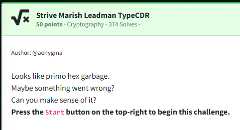
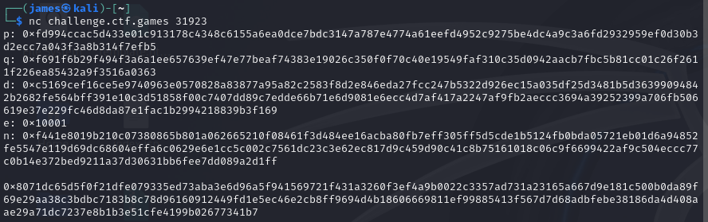

Challenge:



We are told to decipher the primo hex garbage.

If we netcat in, we are given the following to decipher:

```
p: 0xfd994ccac5d433e01c913178c4348c6155a6ea0dce7bdc3147a787e4774a61eefd4952c9275be4dc4a9c3a6fd2932959ef0d30b3d2ecc7a043f3a8b314f7efb5  
q: 0xf691f6b29f494f3a6a1ee657639ef47e77beaf74383e19026c350f0f70c40e19549faf310c35d0942aacb7fbc5b81cc01c26f2611f226ea85432a9f3516a0363  
d: 0xc5169cef16ce5e9740963e0570828a83877a95a82c2583f8d2e846eda27fcc247b5322d926ec15a035df25d3481b5d36399094842b2682fe564bff391e10c3d51858f00c7407dd89c7edde66b71e6d9081e6ecc4d7af417a2247af9fb2aeccc3694a39252399a706fb506619e37e229fc46d8da87e1fac1b2994218839b3f169  
e: 0x10001  
n: 0xf441e8019b210c07380865b801a062665210f08461f3d484ee16acba80fb7eff305ff5d5cde1b5124fb0bda05721eb01d6a94852fe5547e119d69dc68604effa6c0629e6e1cc5c002c7561dc23c3e62ec817d9c459d90c41c8b75161018c06c9f6699422af9c504eccc77c0b14e372bed9211a37d30631bb6fee7dd089a2d1ff  
  
0x8071dc65d5f0f21dfe079335ed73aba3e6d96a5f941569721f431a3260f3ef4a9b0022c3357ad731a23165a667d9e181c500b0da89f69e29aa38c3bdbc7183b8c78d96160912449fd1e5ec46e2cb8ff9694d4b18606669811ef99885413f567d7d68adbfebe38186da4d408aae29a71dc7237e8b1b3e51cfe4199b02677341b7   
```



We know from the prefix and the challenge text that we are dealing with a hex string.  Additionally, the values of p, q, d, and e are generally used denote an rsa encryption.  
