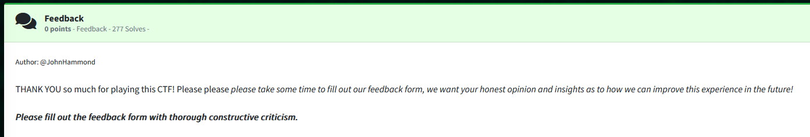

Challenge:



We are given a ciphered string.

```squiqhyiiycfbudeduutvehrhkjki```

Based on the name of the challenge, I assumed this was an exercise in Caesar ciphering.  I pasted the string into the following website and cycled until I found text that was decoded, which ended up being a cipher offset of 10 to discover the cipher text of ```caesarissimplenoneedforbrutus```


[Caesar Cipher](https://cryptii.com/pipes/caesar-cipher)

Then, per the challenge notes, I converted the cipher text to MD5 to get the flag via [Cyber Chef](https://gchq.github.io/CyberChef/) and wrapped the string in flag{} for submission.


Flag: ```flag{c945bb2173e7da5a292527bbbc825d3f}```

