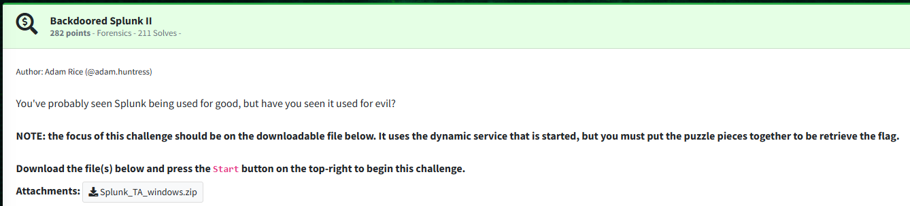
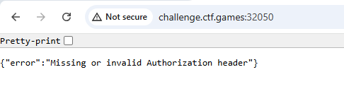
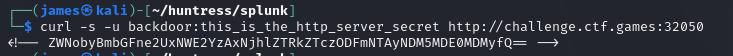
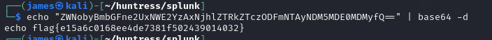

Challenge:



We are tasked with using Splunk for evil and given a zip file.

If we browse to the website, we receive a missing or invalid authorization header message.




To do:  add steps to decode the logs.


After we decode the script, we find a base64 blob, which upon further analysis decodes that there is an invoke-webrequest present with some headers.

Using the credentials with curl, we are able to retrieve the flag.

```curl -s -u backdoor:this_is_the_http_server_secret http://challenge.ctf.games:32050```

The curl returns a string which appears to be base64 encoded.



Base64 decoding the string reveals our flag.



Flag: ```flag{e15a6c0168ee4de7381f502439014032}```