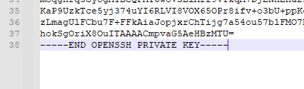
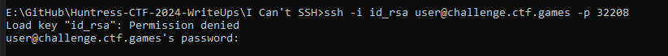
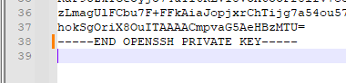
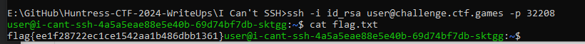

Challenge:


We are given an id_rsa file to work with.



Attempting to connect with it, we receive a load key error which is indicative of a bad format.



Standard format for an id_rsa key has a trailing carriage return while this file does not.



A carriage return was appended and I re-attempted to SSH in successfully.

Flag:  ```flag{ee1f28722ec1ce1542aa1b486dbb1361}```


