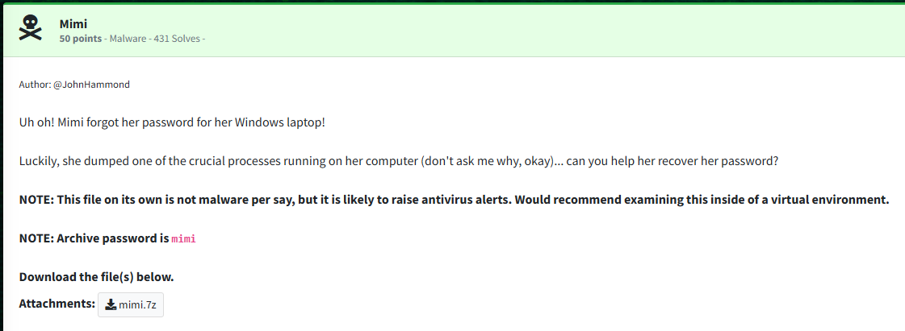
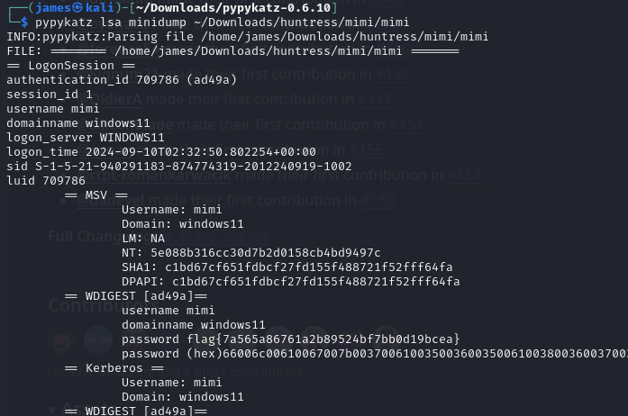

Challenge:



We are given a memory dump and tasked with recoverying the user's password.


After extracting and examining the file, we can confirm it is a memory dump.  Based on this, we should analyze the memory dump to see what we can find.

The tool of choice for this is [pypykatz](https://github.com/skelsec/pypykatz/)

After installing the latest version, we can run the following to extract the contents.

```pypykatz lsa minidump ~/Downloads/huntress/mimi/mimi```

Among the passwords, we see our flag.



Flag: ```flag{7a565a86761a2b89524bf7bb0d19bcea}```

