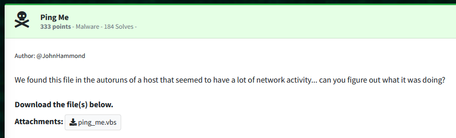
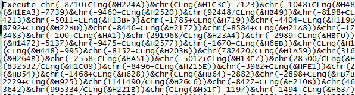
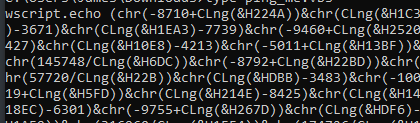
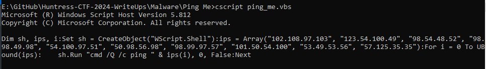
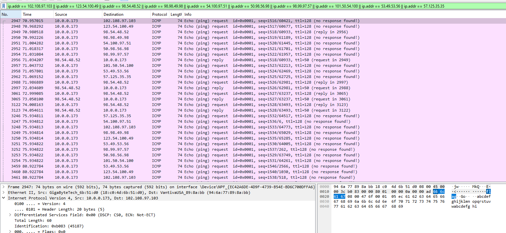
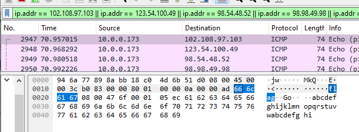
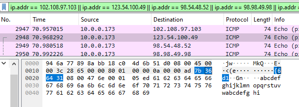
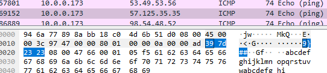

Challenge:



We are given a VB script file to work with.  Upon examination, we can see it is attempting to execute some obfuscated code.



To see what the code is doing, I substituted the Execute command with wscript.echo to see what it's actually trying to do without having to work through converting the code.



It looks like the script is executing a series of pings, which is a tactic used for C2 and evasion via ICMP traffic.



I opened Wireshark and executed the script to see what it was doing, filtering by all of the IP addresses.

```ip.addr == 102.108.97.103 || ip.addr == 123.54.100.49 || ip.addr == 98.54.48.52 || ip.addr == 98.98.49.98 || ip.addr == 54.100.97.51 || ip.addr == 50.98.56.98 || ip.addr == 98.99.97.57 || ip.addr == 101.50.54.100 || ip.addr == 53.49.53.56 || ip.addr == 57.125.35.35```



Within the ping responses, I found pieces of what appeared to be a flag.  For example, in the first IP in the list, 102.108.97.103, there is a block of bytes that indicates the word 'flag'.  Checking the next IP in the list, 123.54.100.49 at the same part of packet, I found the next piece of the flag "{6d1" and was able to reconstruct the flag in entirety by checking each of the IP addresses in order until I reached the end of the flag.








```flag{6d1b604bb1b6da32b8bbca9e26d51589}```