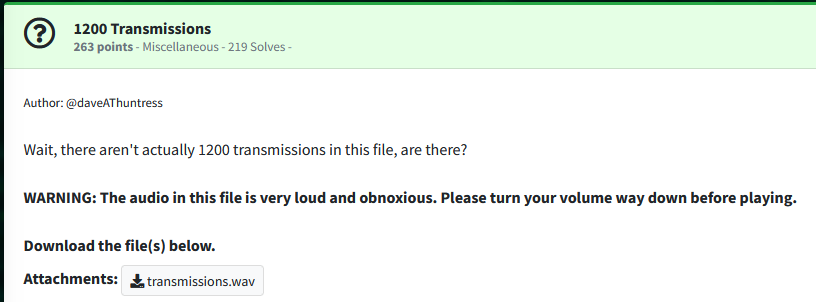
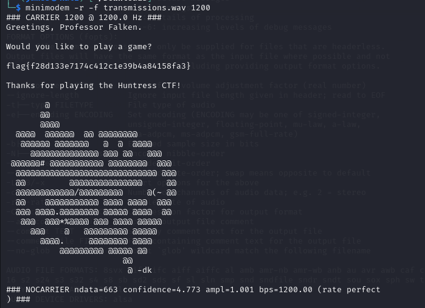

Challenge:



We are given an audio file to work with.

Listening to the audio, it vaguely sounds like a tone that you would hear out of a modem.  Doing some research, with the 1200 as a hint, I found kali has an application called minimodem built in and that 1200 is for transferring ascii text.  I combined everything and was able to extract the flag with the following command.

```minimodem -r -f transmissions.wav 1200```



```flag{f28d133e7174c412c1e39b4a84158fa3}```

Link I used for information on minimodem:

[https://code.tools/man/1/minimodem/](https://code.tools/man/1/minimodem/)