Challenge:

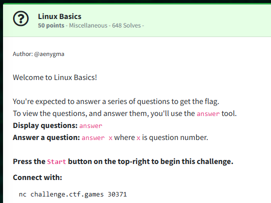

It's quiz time!

We netcat to the machine and type ```answer``` to bring up the questions.

Question 0: What's your home directory?  

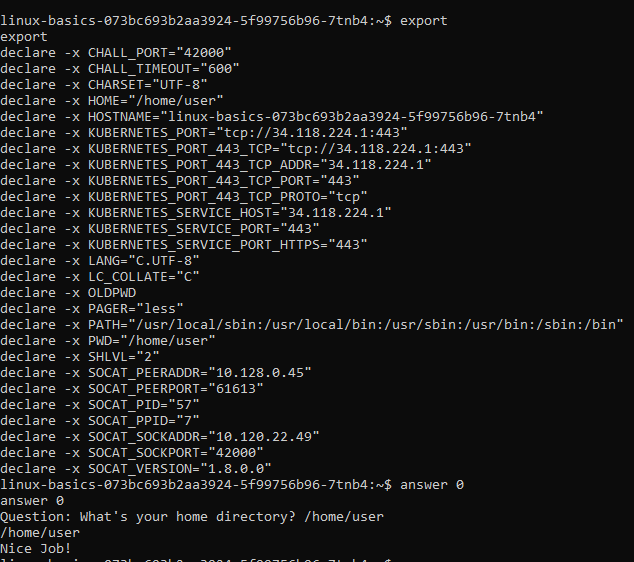

We can find the answer by exporting environment variables.  ```export```

Answer: ```/home/user```

Question 1: Search the man pages. What command would you use to generate random permutations?

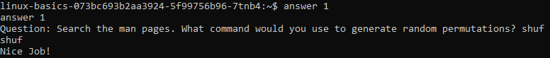

A little bit of Googling reveals the answer.  However, to find it in linux, ```man shuf```

Answer: ```shuf```

Question 2: On what day was /home/user/myfile.txt modified? Use the date format 2019-12-31

We can find our answer by listing the file.  ```ls -la /home/user/myfile.txt```

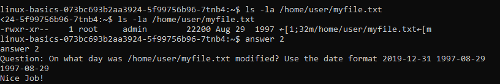

Answer: ```1997-08-29```

Question 3: How big is /home/user/myfile.txt, in kilobytes? Round to the nearest whole number.

We can find the answer by referencing the image we took in Q2 and listing the file, we see the file size is 22000 in bytes.  So I rounded to KB, resulting in 22.  ```ls -la /home/user/myfile.txt```

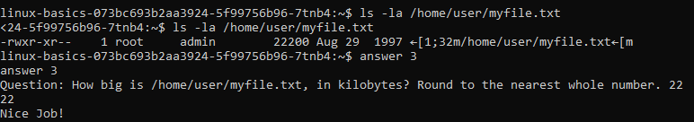

Answer: ```22```

Question 4: What user owns the file /home/user/myfile.txt

Listing the file reveals our answer.  ```ls -la /home/user/myfile.txt```

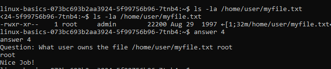

Answer: ```root```

Question 5: What's the 3-digit octal permissions of the file /home/user/myfile.txt? (e.g 777)

We can find our answer by running the stat command.  ```stat /home/user/myfile.txt```

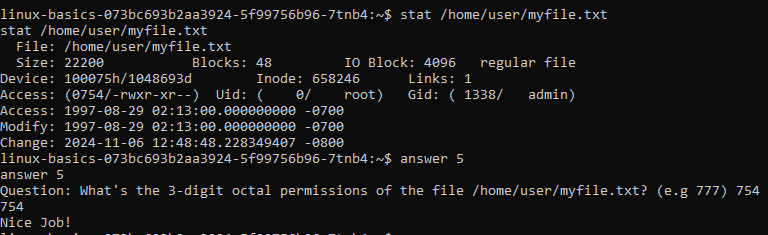

Answer: ```754```

Question 6: What is the user id of 'admin'?

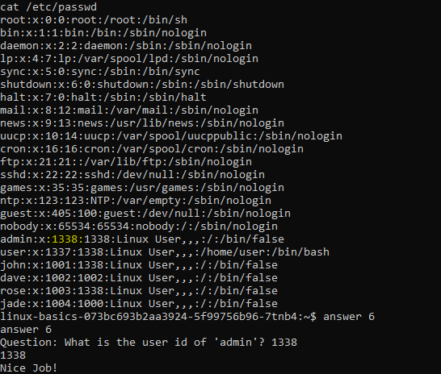

We can find the answer by catting /etc/passwd ```cat /etc/passwd```

Answer: ```1338```

Question 7: There is a user 'john' on the system. Can they write to /home/user/myfile.txt? (yes/no)

We can find our answer by listing the file. Note the w bit is not set on the group portion of permissions.  ```ls -la /home/user/myfile.txt```

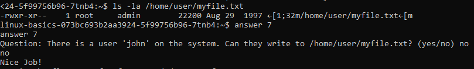

Question 8: Can the 'admin' user execute /home/user/myfile.txt? (yes/no)

Listing the file reveals our answer.  Note the x bit set on the user portion of permissions.  ```ls -la /home/user/myfile.txt```

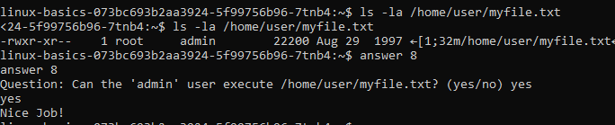

Answer: ```yes```

Question 9: Which user on the system, except for you, root, admin and john, can execute /home/user/myfile.txt?

We can find the answer by catting the /etc/group file ```cat /etc/group```.
This reveals all members of the admin group.

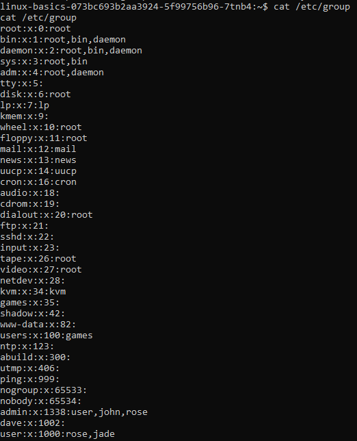
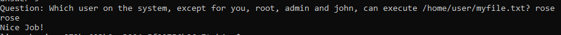

Answer: ```rose```

Question 10: /home/user/myfile.txt looks like a txt file, but it actually isn't. What kind of file is it?

We can find the answer by running the file command ```file /home/user/myfile.txt```

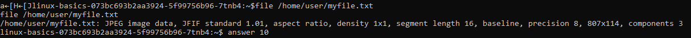
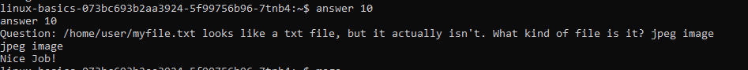

Answer: ```jpeg image```

After solving all of the questions, we receive the flag.

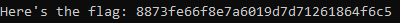

Flag: ```flag{8873fe66f8e7a6019d7d71261864f6c5}```