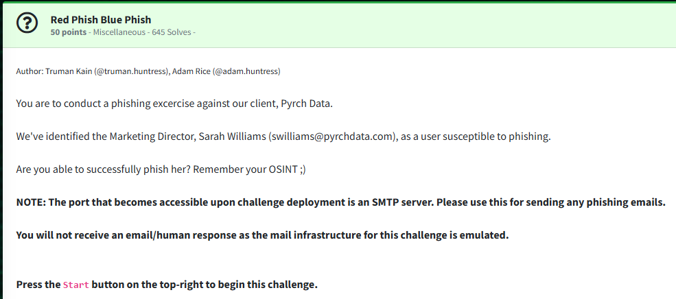
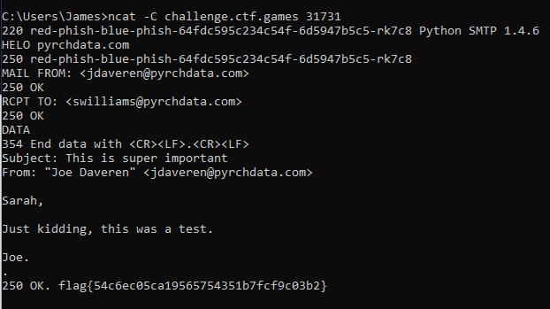

Challenge:



We are asked to conduct a phishing exercise and are given Sarah Williams as a target.

If we visit the websyte pyrchdata.com and browse to the "Meet the Team" tab, we get a list of team members.  Of notable interest is the IT security manager, Joe Daveren.


From here, I connected with netcat and performed a phishing attack.

```HELO pyrchdata.com```

```MAIL FROM: <jdaveren@pyrchdata.com>```

```RCPT TO: <swilliams@pyrchdata.com>```

```DATA```

```Subject: This is super important  
From: "Joe Daveren" <jdaveren@pyrchdata.com>  
  
Sarah,  
  
Just kidding, this was a test.  
  
Joe.```

After completing the phish, we receive the flag.



Flag: ```flag{54c6ec05ca19565754351b7fcf9c03b2}```