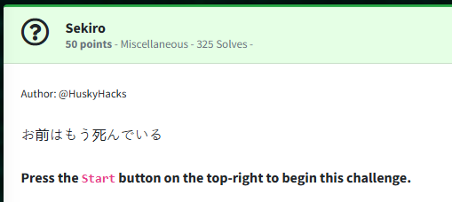
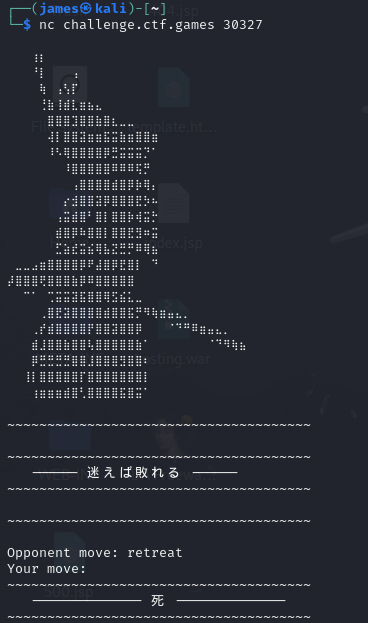
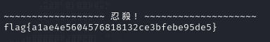

Challenge:



The challenge translates to "You are dead."

After we connect to the machine, we receive an opponent move and are prompted for a move.



After connecting multiple times, we eventually come up with the list of moves:

```advance, retreat, block, strike```

Furthermore, if we start responding, we can find combinations to keep the game going.

Opponent: retreat  
Your move: strike  
  
Opponent: strike  
Your move: block  
  
Opponent: block  
Your move: advance  
  
Opponent: advance  
Your move: retreat  

I took this knowledge and wrote a python script to connect to the machine and play the game.

```python  
from socket import socket

sock = socket()
sock.connect(('challenge.ctf.games',30327))

while True:
        data = sock.recv(1024)
        receivedData = data.decode("utf-8",errors="ignore")

        if "strike" in receivedData:
                print("Opponent Move: Strike, counter block")
                counter = bytes("block\n","utf-8")
                sock.send(counter)
        elif "retreat" in receivedData:
                print("Opponent Move: Retreat, counter strike")
                counter = bytes("strike\n","utf-8")
                sock.send(counter)
        elif "advance" in receivedData:
                print("Opponent Move: Advance, counter retreat")
                counter = bytes("retreat\n","utf-8")
                sock.send(counter)
        elif "block" in receivedData:
                print("Opponent Move: Block, counter advance")
                counter = bytes("advance\n","utf-8")
                sock.send(counter)
        elif "Disconnected" in receivedData:
                print(receivedData)
                break
        elif "flag" in receivedData:
                print(receivedData)
                break

        print(receivedData)
```

Eventually, we defeat the samurai and claim our flag.



Flag: ```flag{a1ae4e5604576818132ce3bfebe95de5}```