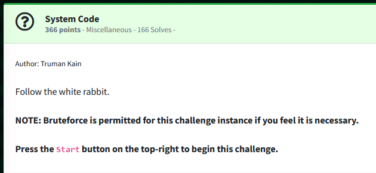
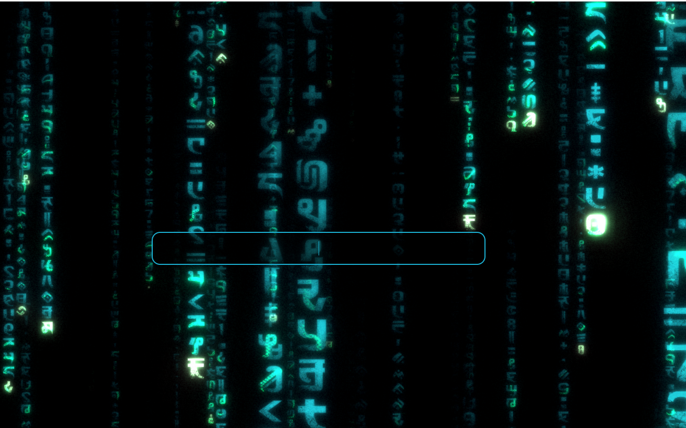
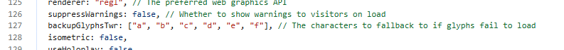
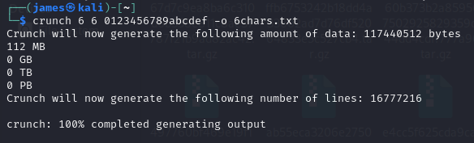
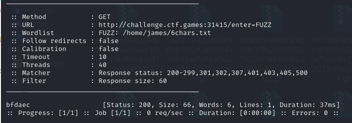
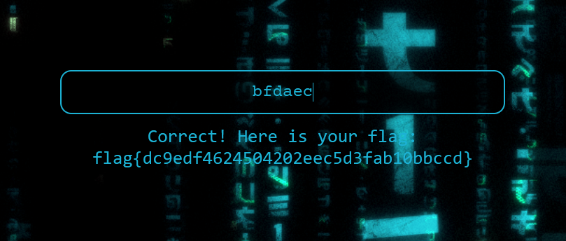

Challenge:



We are presented with a web page and told to follow the white rabbit.



There isn't much to go on with the web page.  However, after looking at the source code for config.js, we see an array that seems different from the repository that is linked in credit for the Matrix template named 'backupsGlyphsTwr'. 



My assumption in this challenge is 'Twr' is supposed to allude to the white rabbit and given there isn't a anything else to go on, ultimately, I decided to just try brute forcing all combinations of the letters.

I used crunch to generate all possible combinations of the a-f across six characters

```crunch 6 6 abcdef -o 6chars.txt```



I then fuzzed the website following the submission parameters, filtering size 60 out.

```ffuf -w 6chars.txt -u http://challenge.ctf.games:31415/enter=FUZZ --fs 60```

I received exactly one response from my list.  ```bfdaec```



I type it into the page and received the flag.

Flag: ```flag{dc9edf4624504202eec5d3fab10bbccd}```

