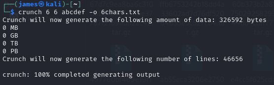

Challenge:


We are presented with a web page and told to follow the white rabbit.

There isn't much to go on with the web page.  The only real thing I could think of was, given the name being 'System Code', it was probably looking for a web code of some sort.  The website uses a Matrix style lettering, but is a shaded in a blue hue.


Ultimately, I decided to just try brute forcing all of the color codes and was successful.

I used crunch to generate all possible combinations of 0-9 and a-f represending the full range of color codes for HTML.

```crunch 6 6 0123456789abcdef -o 6chars.txt```



I then fuzzed the website following the submission parameters, filtering size 60 out.

```ffuf -w 6chars.txt -u http://challenge.ctf.games:31415/enter=FUZZ --fs 60```

I received exactly one response from my list.  ```bfdaec```


I type it into the page and received the flag.

Flag: ```flag{dc9edf4624504202eec5d3fab10bbccd}```

