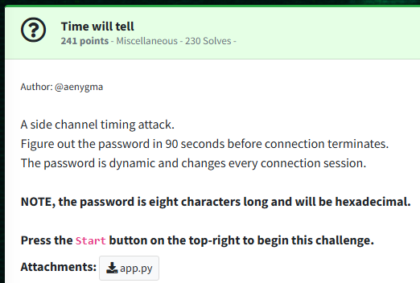
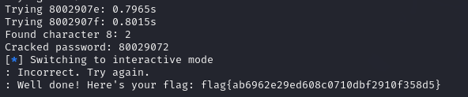

Challenge:



We are given a script and are tasked with performing a side channel timing attack.

To do:  add notes for writing the script.


After executing the script, we start receiving feedback for the characters.


Eventually, we crack our random password and claim the flag.



Flag: ```flag{ab6962e29ed608c0710dbf2910f358d5}```