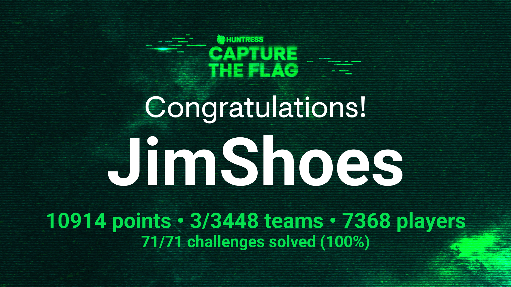

# Huntress CTF 2024 WriteUps
Release schedule for the event:

Tuesday, October 1, 2024
- Read The Rules - [Write-up](https://github.com/JimKrolik/Huntress-CTF-2024-WriteUps/tree/df14a5707b1bb72b7a42b7d30c049d415588aa05/Warmups/Read%20The%20Rules)
- Technical Support - [Write-up](https://github.com/JimKrolik/Huntress-CTF-2024-WriteUps/tree/6e794bee40b2747c8012adb04d83ad6321593492/Warmups/Technical%20Support)
- More Challenges Tomorrow (No flag)
- MatryoshkaQR - [Write-up](https://github.com/JimKrolik/Huntress-CTF-2024-WriteUps/tree/2f663f4c3e5280da341b8ea76443c4f2e17eae32/Warmups/MatryoshkaQR)
- Base64by32 - [Write-up](https://github.com/JimKrolik/Huntress-CTF-2024-WriteUps/tree/2ff9dba1c507ab8017ec7fdb30d17f8f76dc6e3e/Scripting/Base64by32)
- Too Many Bits - [Write-up](https://github.com/JimKrolik/Huntress-CTF-2024-WriteUps/tree/11cca51dd2c403bee0f703b2bcc1b529f146b8a8/Warmups/Too%20Many%20Bits)
- Strange Calc

Wednesday, October 2, 2024
- No Need For Brutus - [Write-up](https://github.com/JimKrolik/Huntress-CTF-2024-WriteUps/tree/13f9e2ae4b922ec8fcfe7d826c45ddd973bbda5f/Cryptography/No%20need%20for%20Brutus)
- Red Phish Blue Phish - [Write-up](https://github.com/JimKrolik/Huntress-CTF-2024-WriteUps/tree/b5a53b1237bb13613fafa833163ee8bc47dca018/Miscellaneous/Red%20Phish%20Blue%20Phish)

Thursday, October 3, 2024
- Cattle - [Write-up](https://github.com/JimKrolik/Huntress-CTF-2024-WriteUps/tree/1b2184df564847feb10431c1c64689011ca957de/Warmups/Cattle)
- Nightmare on Hunt Street (Bundle)
- russian_roulette

Friday, October 4, 2024
- Whamazon - [Write-up](https://github.com/JimKrolik/Huntress-CTF-2024-WriteUps/tree/e0880ede02d953a8700a5ca9f7625c83d7bd49fa/Warmups/Whamazon)
- malibu

Saturday, October 5, 2024
- Unbelievable - [Write-up](https://github.com/JimKrolik/Huntress-CTF-2024-WriteUps/tree/85930c9f68bb55cd7997c2ddd31cb49321004c4e/Warmups/Unbelievable)
- ocean_locust

Sunday, October 6, 2024
- txt_message
- discount_programming_devices

Monday, October 7, 2024
- Mimi - [Write-up](https://github.com/JimKrolik/Huntress-CTF-2024-WriteUps/tree/d9ae42a9128e2b183e024de88b7e88acbec96b69/Malware/Mimi)
- System Code - [Write-up](https://github.com/JimKrolik/Huntress-CTF-2024-WriteUps/tree/e0880ede02d953a8700a5ca9f7625c83d7bd49fa/Miscellaneous/System%20Code)

Tuesday, October 8, 2024
- zimmer_down
- ran_somewhere
- Base-p- - [Write-up](https://github.com/JimKrolik/Huntress-CTF-2024-WriteUps/tree/e0880ede02d953a8700a5ca9f7625c83d7bd49fa/Miscellaneous/Base-p-)
- Mystery - [Write-up](https://github.com/JimKrolik/Huntress-CTF-2024-WriteUps/tree/3dd74ee620cbf1a2216e9937084ba304145b6135/Warmups/Mystery)

Wednesday, October 9, 2024
- GoCrackMe1
- I Can't SSH - [Write-up](https://github.com/JimKrolik/Huntress-CTF-2024-WriteUps/tree/e0880ede02d953a8700a5ca9f7625c83d7bd49fa/Warmups/I%20Can't%20SSH)

Thursday, October 10, 2024
- GoCrackMe2
- Finders Fee - [Write-up](https://github.com/JimKrolik/Huntress-CTF-2024-WriteUps/tree/f30fa2b69f5e0f8aad91d0288a066d91624b016c/Warmups/Finders%20Fee)

Friday, October 11, 2024
- GoCrackMe3
- Typo - [Write-up](https://github.com/JimKrolik/Huntress-CTF-2024-WriteUps/tree/e0880ede02d953a8700a5ca9f7625c83d7bd49fa/Warmups/Typo)

Saturday, October 12, 2024
- x-ray
- zulu

Sunday, October 13, 2024
- ObfuscationStation
- Little Shop Of Hashes (Bundle)

Monday, October 14, 2024
- keyboard_junkie
- HiddenStreams

Tuesday, October 15, 2024
- sekiro
- 1200 Transmissions - [Write-up](https://github.com/JimKrolik/Huntress-CTF-2024-WriteUps/tree/e0880ede02d953a8700a5ca9f7625c83d7bd49fa/Miscellaneous/1200%20transmissions)

Wednesday, October 16, 2024
- Echo Chamber - [Write-up](https://github.com/JimKrolik/Huntress-CTF-2024-WriteUps/tree/e0880ede02d953a8700a5ca9f7625c83d7bd49fa/Scripting/Echo%20Chamber)
    
Thursday, October 17, 2024
- Linux Basics - [Write-up](https://github.com/JimKrolik/Huntress-CTF-2024-WriteUps/tree/70a644e5d4e4da7533580c5ff7c62d43d970a23d/Miscellaneous/Linux%20Basics)
- The Void - [Write-up](https://github.com/JimKrolik/Huntress-CTF-2024-WriteUps/tree/e994dc323e866eed485b509076f4d8d74ab995bc/Warmups/The%20Void)
- moveable
- baby buffer overflow

Friday, October 18, 2024
- eepy
- permission_to_proxy

Saturday, October 19, 2024
- stack_it
- eco_friendly

Sunday, October 20, 2024
- Y2J - [Write-up](https://github.com/JimKrolik/Huntress-CTF-2024-WriteUps/tree/0988dfac7509436aab68df18d5d66f39f4944d3e/Web/Y2J)
- splunk_ii

Monday, October 21, 2024
- rsa_decrypt
- helpfuldesk

Tuesday, October 22, 2024
- rustline
- Plantopia - [Write-up](https://github.com/JimKrolik/Huntress-CTF-2024-WriteUps/tree/e0880ede02d953a8700a5ca9f7625c83d7bd49fa/Web/Plantopia)

Wednesday, October 23, 2024
- Ping Me - [Write-up](https://github.com/JimKrolik/Huntress-CTF-2024-WriteUps/tree/e0880ede02d953a8700a5ca9f7625c83d7bd49fa/Malware/Ping%20Me)
- time_will_tell

Thursday, October 24, 2024
- knights_quest
- ancient_fossil

Friday, October 25, 2024
- pillow_fight
- Feedback - [Write-up](https://github.com/JimKrolik/Huntress-CTF-2024-WriteUps/tree/d33f0e5960097ca95d024b834e1ee4876b0090e7/Feedback)

Saturday, October 26, 2024
- thats_life

Sunday, October 27, 2024
- revenge_of_dpd

Monday, October 28, 2024
- rusty_bin

Tuesday, October 29, 2024
- in_plain_sight

Wednesday, October 30, 2024
- Zippy - [Write-up](https://github.com/JimKrolik/Huntress-CTF-2024-WriteUps/tree/ab913eec7d7621a8a449bfeab8a4afb78dc88425/Web/Zippy)

Thursday, October 31, 2024
- Palimpsest

