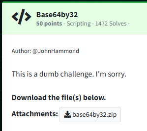
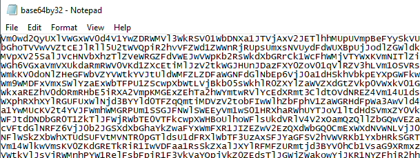
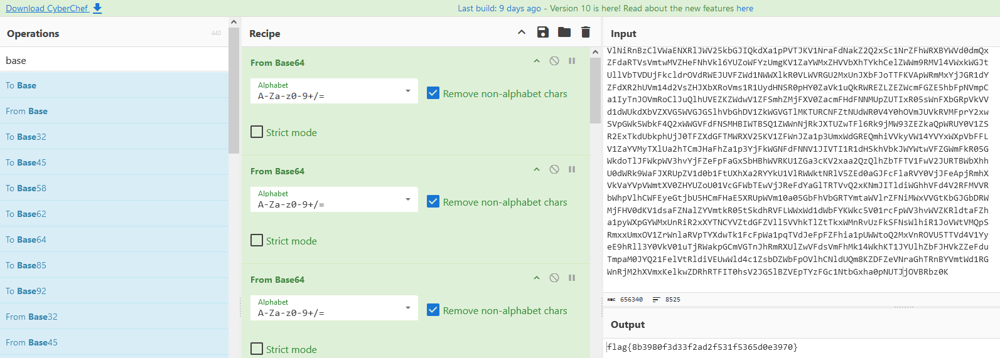

Challenge:



We are given a zip file for examination.  

Upon extraction, we see it is a giant block of text.



Just based on the name of the challenge, my assumption here is the block of text was just base64 encoded 32 times, so I fired up CyberChef and dragged "From Base64" over 32 times to find the flag.




Flag: ```flag{8b3980f3d33f2ad2f531f5365d0e3970}```