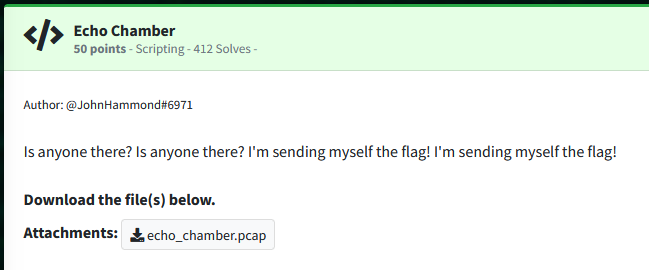
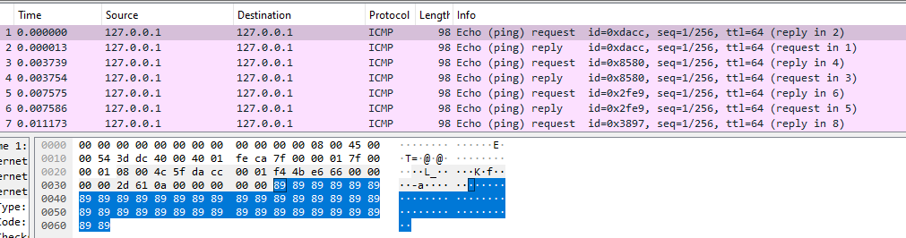

Challenge:



We are given a packet capture to work with.

Opening the pcap file in Wireshark and examining it, we a group of characters in one specific spot as we move packet by packet.  If we take the character of each, we can start to reconstruct what is actually going on.  

Over the first few packets we have hex:

89 50 4e 47 0d




Knowing a bit about file headers really helps here as we can now identify that this is proably an encoded image.
[File Signatures](https://en.wikipedia.org/wiki/List_of_file_signatures)


With that in mind, I wrote a python script to extract the relevant bytes and construct it back into an image.


```python
from scapy.all import *

capture = rdpcap('echo_chamber.pcap')

with open("image.png","wb") as binary_file:
        for packet in capture:
                if packet[ICMP].type == 8: # Echo request
                        binary_file.write(packet.load[-1:])
```

Opening the image reveals our flag.


flag: ```flag{6b38aa917a754d8bf384dc73fde633ad}```