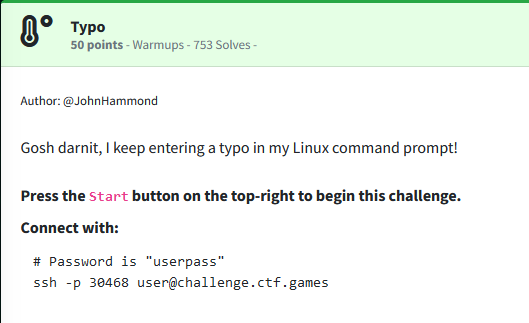
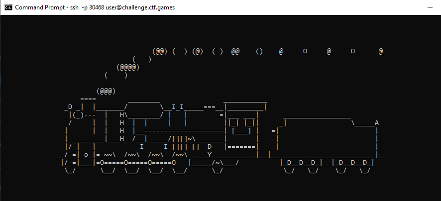
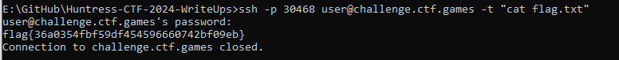

Challenge:



We are prompted to SSH into the machine.  Upon doing so, we find an ascii train going across the screen before the connection drops.



The solution is to cat the flag upon connection.

```ssh -p 30468 user@challenge.ctf.games -t "cat flag.txt"```

Flag: ```flag{36a0354fbf59df454596660742bf09eb}```

