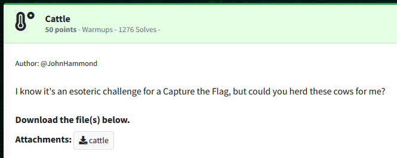
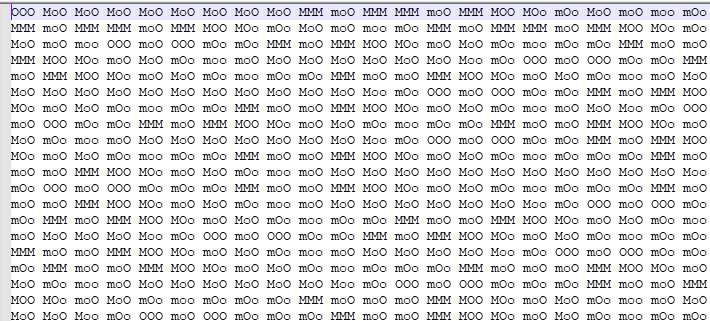
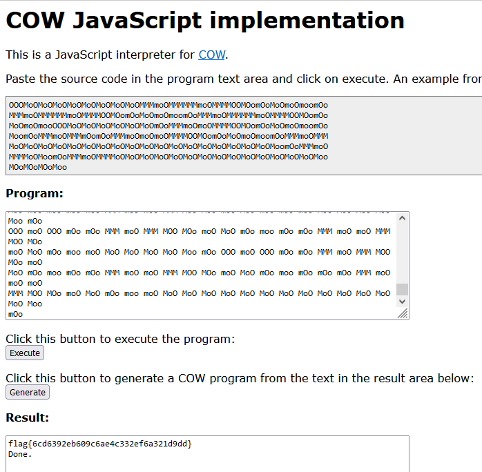

Challenge:



We are given a file named 'cattle'.

Examining the file, we see it is a bunch of different cases of the word moo.




Doing some research, we eventually find a JavaScript COW interpreter. [https://frank-buss.de/cow.html](https://frank-buss.de/cow.html)

After pasting the contents of our file in, the flag is successfully decoded.



Flag:  ```flag{6cd6392eb609c6ae4c332ef6a321d9dd}```


