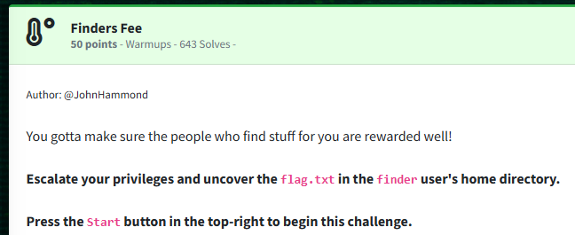
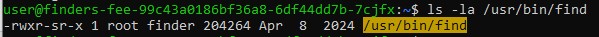
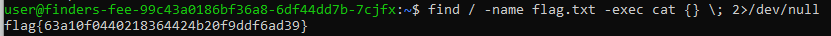

Challenge:



We are told that we need to escalate our privileges to claim the flag.  There seems to be a very heavy emphasis on word find here, so let's check the permissions on 'Find'.



We can see that the SGID bit is set for find.  Because of this, we are able to execute in the same permission set as the owner, which in this case is root.

With that, we are able to find the flag in the root user's directory.

```find / -name flag.txt -exec cat {} \; 2>/dev/null```



With that, we have our flag.

Flag: ```flag{63a10f0440218364424b20f9ddf6ad39}```