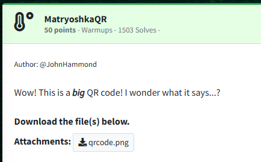
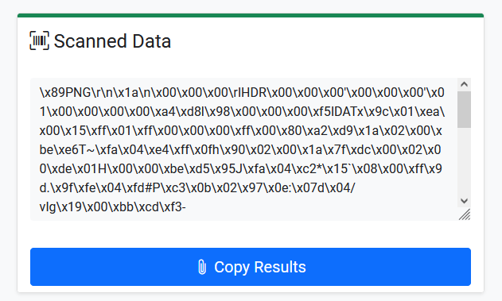

Challenge:

We are given a QR code as the challenge.

If we retrieve the text out of the QR code, we are given a bunch of byte data, which appears to decode to another PNG based on the resolved bytes (PNG, IDAT, etc.)

(https://scanqr.org)

