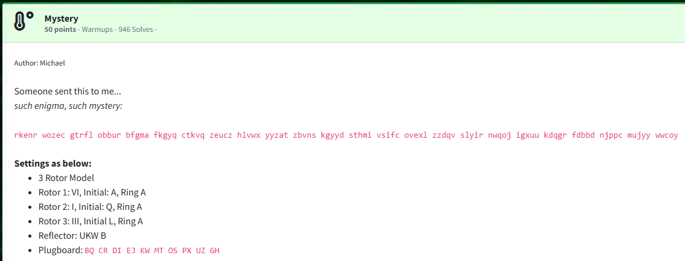
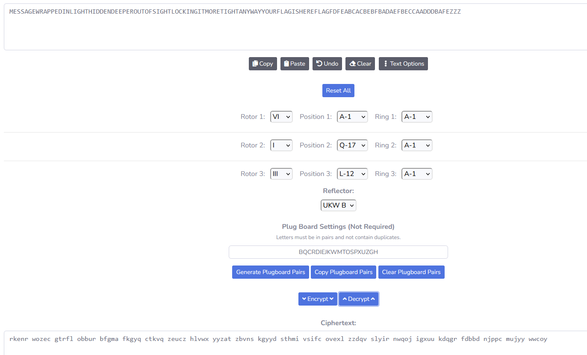
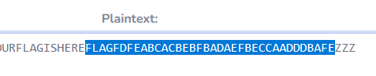

Challenge:



Just based off of my knowledge of history, I figured this was alluding to the enigma machine from World War 2.

I used the following [website](https://www.cachesleuth.com/enigma.html) to decode the enigma cipher.



And the decoded cipher text contains our flag.




Flag: ```flag{fdfeabcacbebfbadaefbeccaadddbafe}```