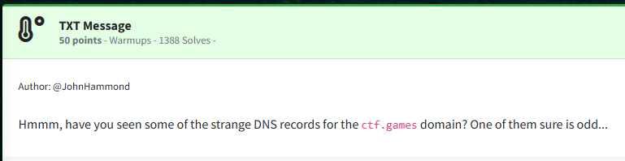
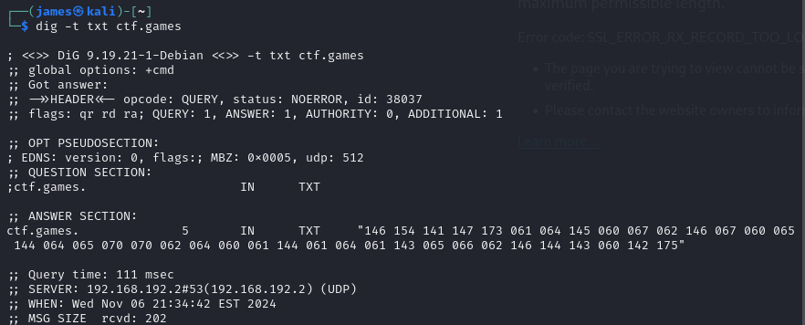
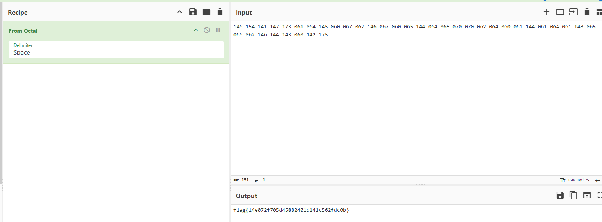

Challenge:



We are tasked with pulling up DNS records off of the ctf.games domain.

By running the dig command with the flag for txt records ```dig -t txt ctf.games```, we see an encoded block of text.



After messing around with a few recipes in [Cyber Chef](https://gchq.github.io/CyberChef), I found that converting from octal reveals the flag.



Flag: ```flag{14e072f705d45882401d141c562fdc0b}```