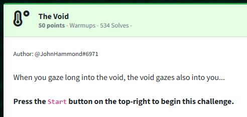
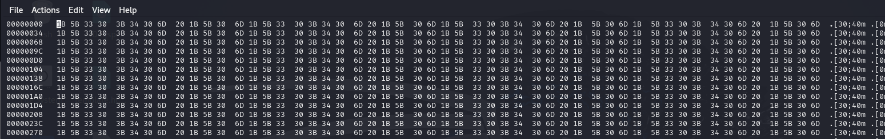
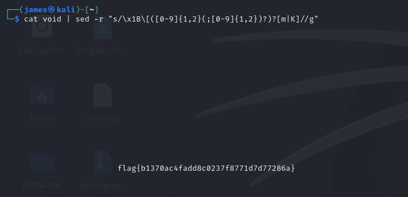

Challenge:



We are told to gaze into the void.

If we connect with netcat into the machine, the cursor just continues to feed data in with next to nothing present.  Piping the output to a file named 'void' and then hexediting the file reveals that it is sending a constant stream of color codes.



After consulting with [stack overflow](https://stackoverflow.com/questions/17998978/removing-colors-from-output), I found the following command and was able to strip out the color codes, which reveals the flag.

```cat void | sed -r "s/\x1B\[([0-9]{1,2}(;[0-9]{1,2})?)?[m|K]//g"```



Flag: ```flag{b1370ac4fadd8c0237f8771d7d77286a}```

