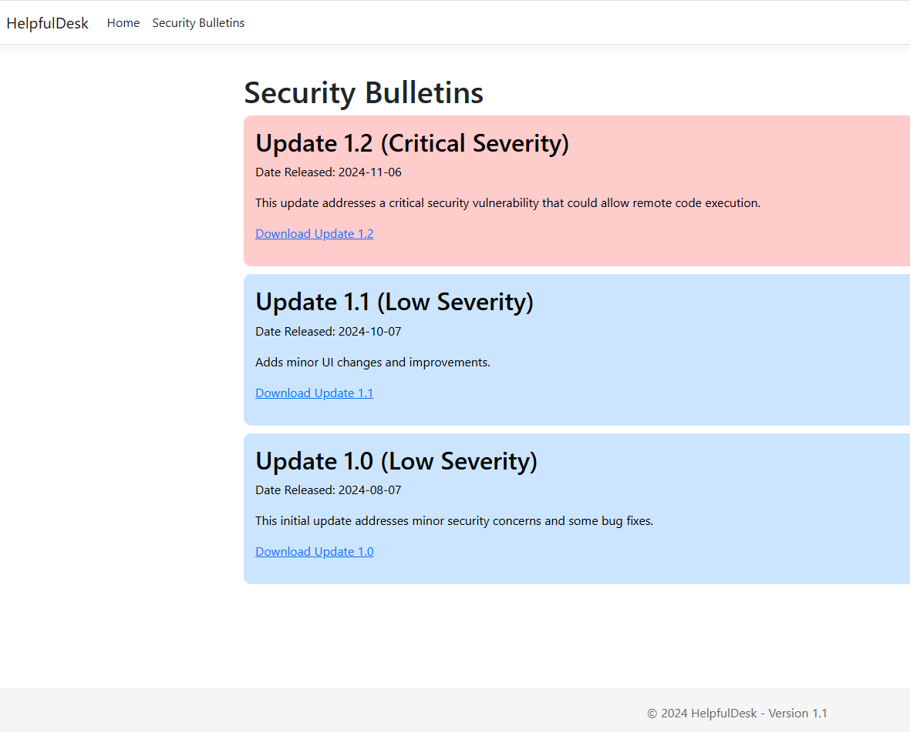
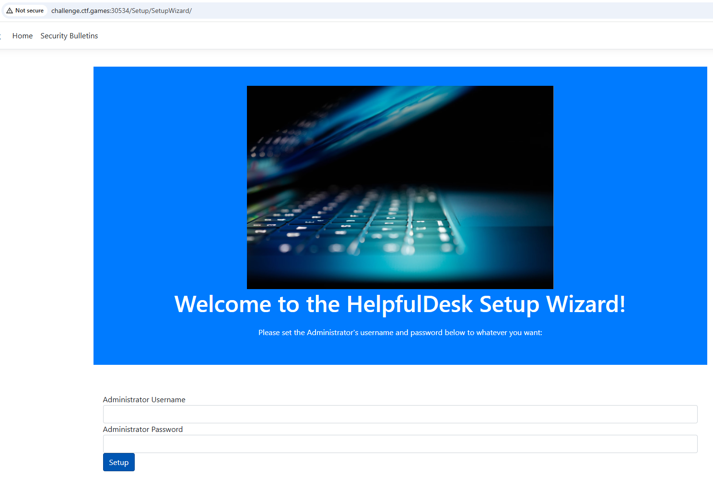

Challenge:


We need to investigate a security breach.

If we poke around the website, we can see it's running version 1.1 and there is a release patch for 1.2 that specifically fixes RCE (remote code execution).




If we download the zips for 1.1 and 1.2, then extract and compare them with diff, we can find the changed files.

```diff 1.1 1.2```


The two files that stand out as different are HelpfulDesk.dll and HelpfulDesk.pdb.

After decompiling the DLL's, we see that the 1.2 release trims a trailing slash against the /Setup/SetupWizard URL.


If we browse to the website at the ```/Setup/SetupWizard/``` appended to the base URL, we are greeted with a screen to create a new administrator account.



After setting up an account and logging in, we see a page with five managed clients.


Viewing the file system of the first machine and drilling into the files, there is a flag.txt file on the administrator's desktop folder.


Downloading the file gives us our flag.

Flag: ```flag{03a6f458b7483e93c37bd94b6dda462b}```