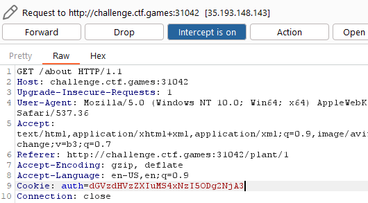
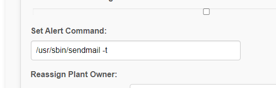
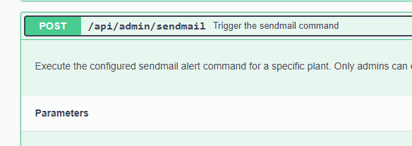
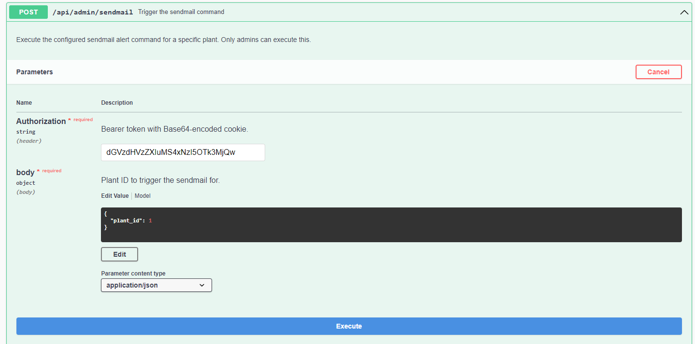
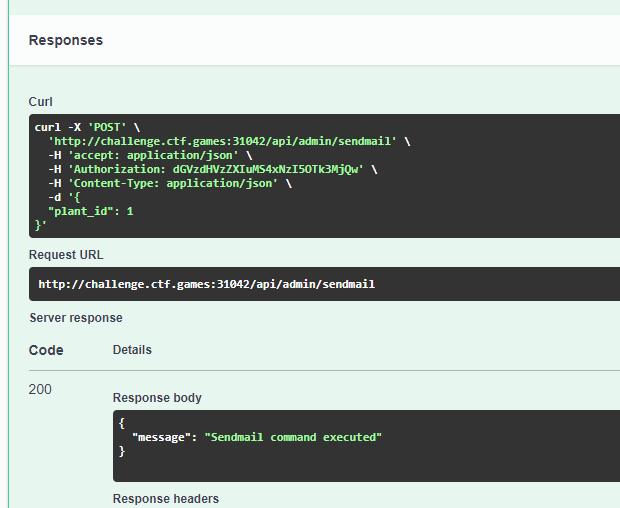
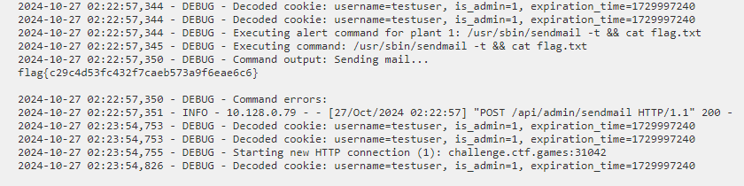

Challenge:


We are presented with a web page to attempt to find a flag.

Logging into the web page with the default credentials, we see a tab for the API Docs.


Looking around, we find the admin authorization is looking for a base64 encoded cookie.


Additionally, if we look at the authorization settings, we can see the laytout for the cookie is 'username.isAdmin.expirationTime'.


Opening BurpSuite and logging in with the intercept on, we see a cookie get generated.


We can decode the cookie to find the username, the 'isAdmin' flag, and the session expiration value.


I then updated the value to set 'isAdmin' to a one and re-encoded the cookie.


Changing the auth cookie out and forwarding the request, we now see the admin panel.




Additionally, we can now access the Logs tab, which appears to give us visibility into the operating system.

If we examine one of the plants, we can see there is an option to set an alert command.



This corresponds with one of the API options we have to trigger the send mail.



We can update the send mail command and append ```&& cat flag.txt```


Finally, we will authorize the API and trigger the command, we can see it successfully sent.





If we go review the log, we will find our flag.



Flag: ```flag{c29c4d53fc432f7caeb573a9f6eae6c6}```
