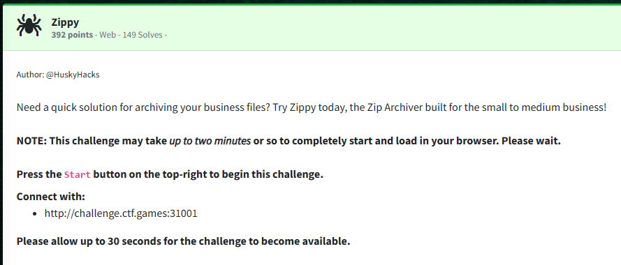
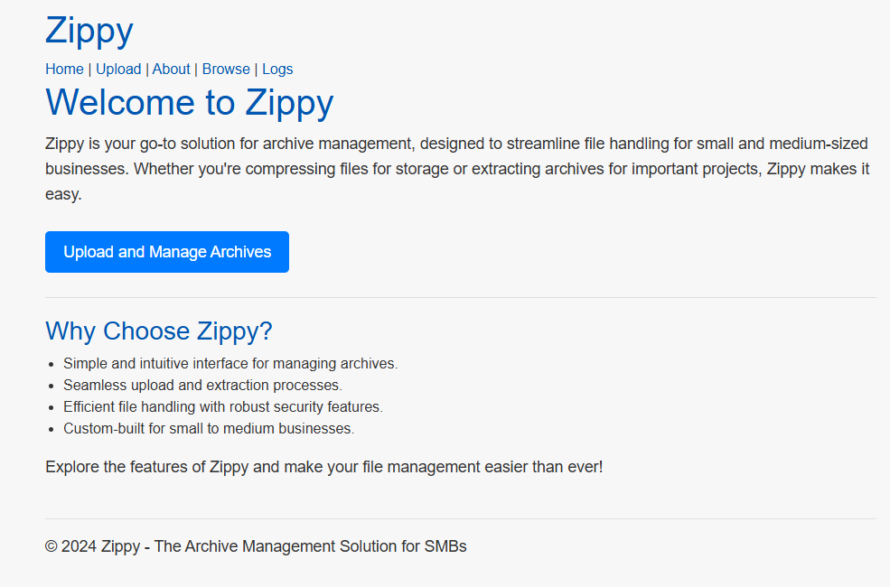
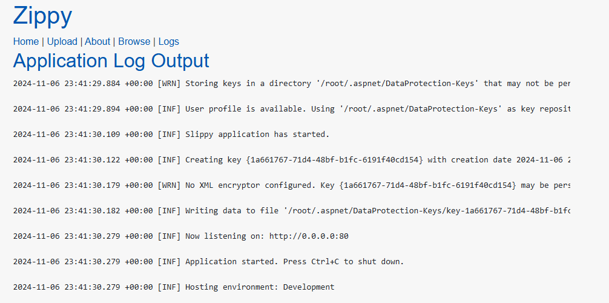
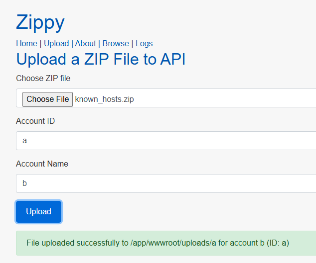
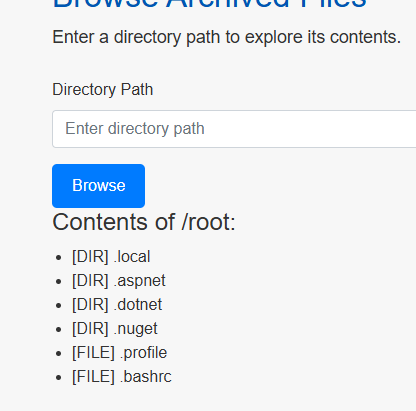
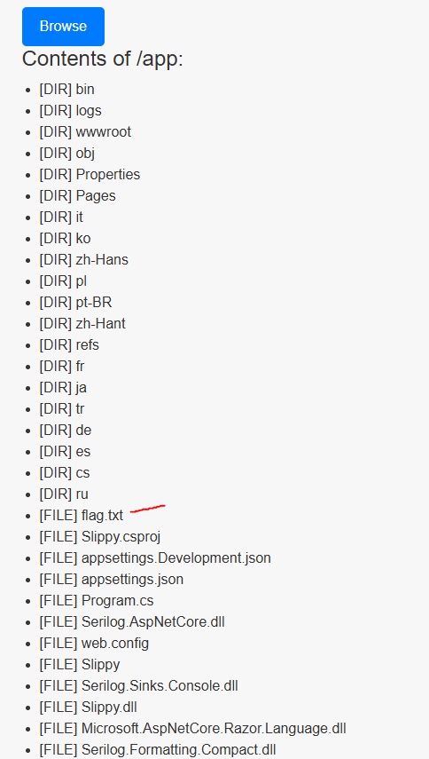
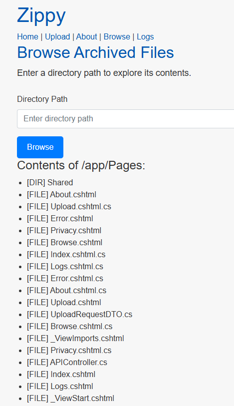
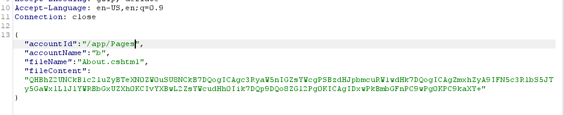
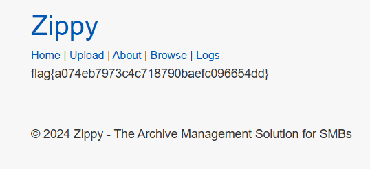

Challenge:



We are tasked with finding a way to abuse the web zip archiver.

Looking at the landing page, we have a few options to navigate through.



Browsing to the Logs tab, we get some underlying information regarding the underlying system.



If we upload a zip file, we can see that the upload path is ```/app/wwwroot/uploads/{accountid}```



Furthermore, if we browse around to /root and /app, we can see the website is likely running on .NET denoted by the .aspnet and .dotnet folders in /root and all of the C# files in /app, which also includes the flag.  This is confirmed by visiting the About tab.





Given we have the capability to read the root folder, we likely are running as root.  Also, with the project in /app being named 'Slippy', I felt this may be susceptible to a zip slip attack.

I tested uploading a file and was able to place a file wherever I wanted.  After browsing around further, I found that /app/Pages held the files for this website.



Using the general guide from [Microsoft](https://learn.microsoft.com/en-us/aspnet/web-pages/overview/data/working-with-files) coupled with a snipped from [Stack Overflow](https://stackoverflow.com/questions/9046215/how-to-manipulate-text-file-in-webpages-cshtml), I was able to put together the following script:

```asp.net
@page  
@using System.IO  
@{  
    string flag = string.Empty;  
    flag = System.IO.File.ReadAllText("/app/flag.txt");  
}  
<div>  
    <p>@flag</p>  
</div>```

I uploaded the file, catching the request with Burpsuite, and overwrote the /app/Pages/About.csthml file.



Browsing back over to the About tab, we find the flag.



Flag: ```flag{a074eb7973c4c718790baefc096654dd}```

