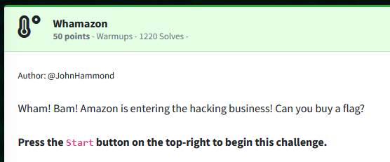
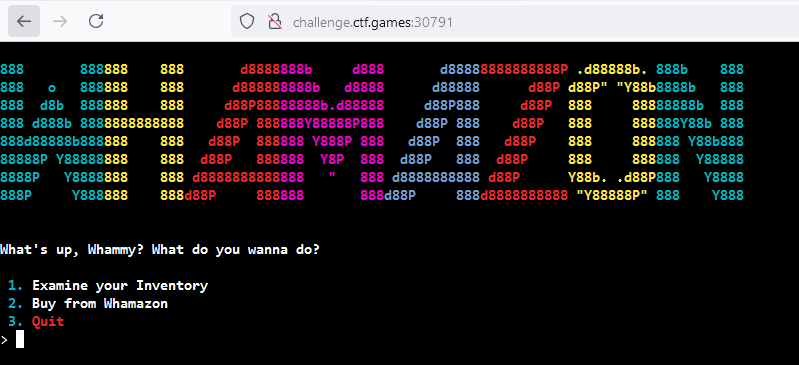
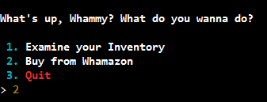
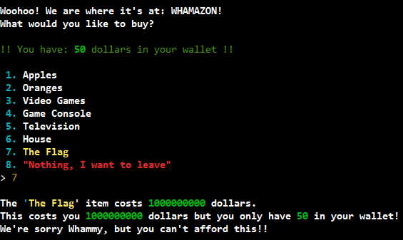
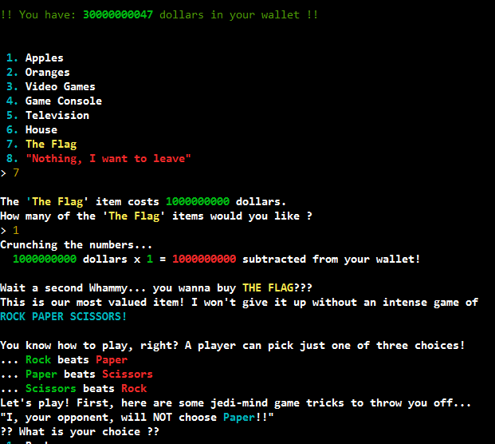
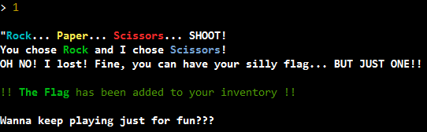
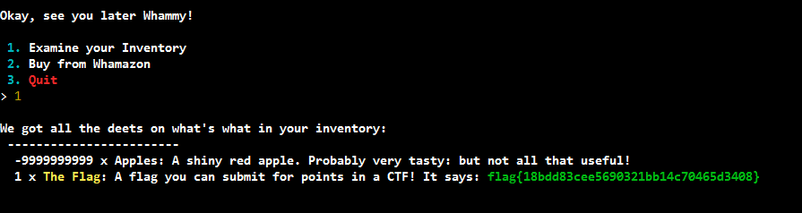

Challenge:



Browsing to the website we are greeted with Whamazon with options to examine our inventory or buy.



Navigating to buy, we see our options with one of them being the flag.



Attempting to buy the flag, we see it is out of our price range.



Looking at our other options, I attempted to buy a negative quantity of apples to trick Whamazon into adding to my credit balance, to which I was successful and now had enough of a balance to purchase the flag.


Attempting to purchase the flag, the site challenges us to rock, paper, scissors.




Using our Jedi mind tricks, we were able to figure out the game was not going to choose paper, so I randomly chose rock and was successful.



We are told the flag is in our inventory, which it now is.


Flag: ```flag{18bdd83cee5690321bb14c70465d3408}```

